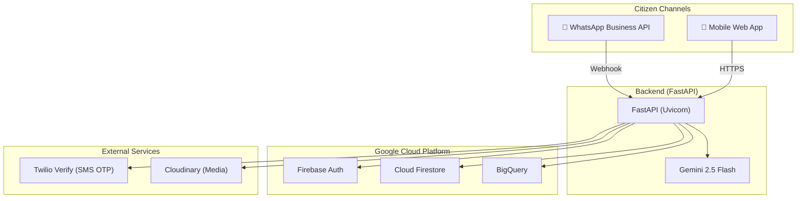
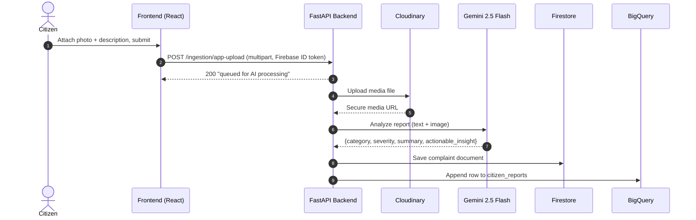
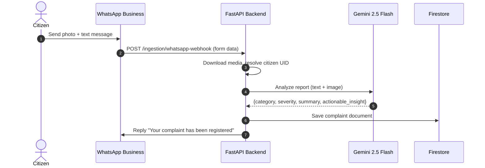
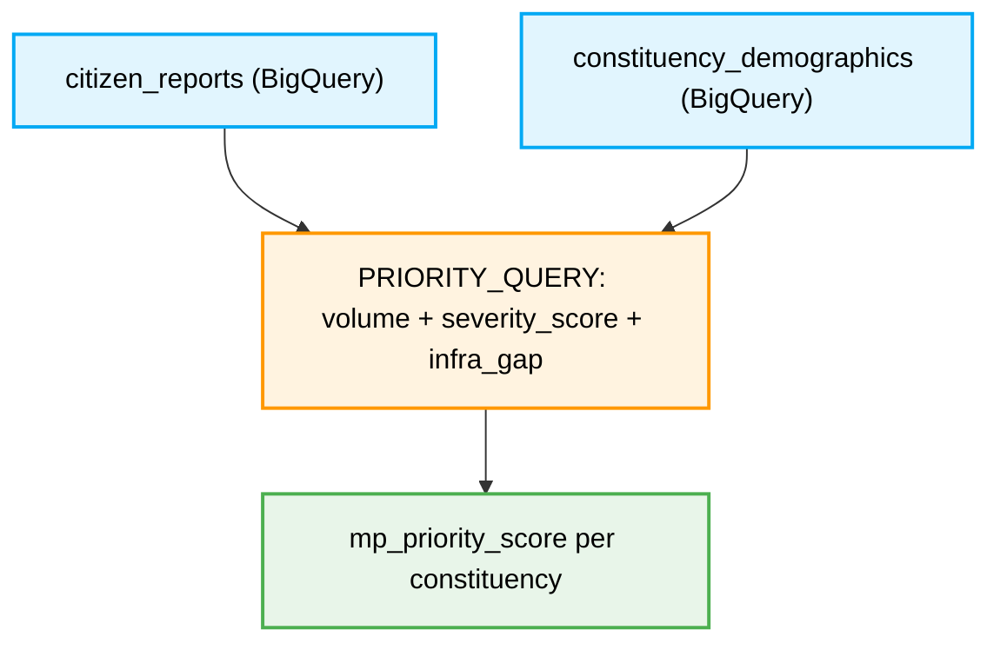

# 🇮🇳 Jan Awaaz AI — People's Priorities

[](https://www.python.org/)
[](https://fastapi.tiangolo.com/)
[](https://vitejs.dev/)
[](https://ai.google.dev/)
[](https://firebase.google.com/)
[](https://cloud.google.com/bigquery)
[](https://docs.docker.com/compose/)

> **Track 1 — AI for Constituency Development Planning**
> A multilingual AI platform where citizens submit development suggestions via text, photos, or WhatsApp messages. The system analyzes submissions using Gemini 2.5 Flash, maps demand hotspots, and combines citizen feedback with constituency demographics to recommend and rank high-priority development works an MP can act on.

## The Problem

MPs receive development requests through public meetings, letters, social media, grievance portals, and direct representations — while local development plans contain dozens of competing proposed projects. There is **no objective way** to consolidate citizen feedback, spot recurring needs, and weigh competing proposals against actual demand.

## Our Solution

Jan Awaaz AI is a **production-ready, end-to-end AI platform** that:

1. **Collects** citizen grievances via a mobile-first web app (text + photo) and WhatsApp Business API integration
2. **Analyzes** each submission with **Gemini 2.5 Flash** multimodal AI to extract category, severity, summary, and an actionable insight for officials
3. **Ranks** development priorities using a BigQuery scoring model that combines real complaint volume, severity weighting, and constituency demographic/infrastructure data
4. **Presents** everything in a real-time MP dashboard with live analytics, interactive grievance details with location mapping, and AI-generated constituency insights

## Architecture Overview



## Key Features

### AI/Technical Execution (Gemini 2.5 Flash)

| Feature | Description |
|---------|-------------|
| **Multimodal Report Analysis** | Every citizen submission (photo + text) is analyzed by Gemini in a single multimodal call, extracting `category`, `severity`, a one-sentence `summary`, and an `actionable_insight` for the responsible official |
| **Language-Aware AI** | Gemini dynamically generates summaries and actionable insights in Hindi (Devanagari) or English based on the citizen's selected language preference |
| **AI-Powered Priority Ranking** | A BigQuery scoring model combines complaint volume, severity weighting, and constituency demographic data into a single `mp_priority_score`, surfacing the highest-need areas objectively |
| **AI-Generated Dashboard Insights** | The MP dashboard generates contextual AI insights (e.g., "Most reported: Road — 43% of total") computed live from real Firestore data |

### Inclusivity & Accessibility

| Feature | Description |
|---------|-------------|
| **Bilingual Interface (English/Hindi)** | Full UI translation for the entire citizen-facing application — login, home, submission form, status tracking, profile — powered by a custom `LanguageContext` with 50+ translation keys |
| **WhatsApp Integration** | Citizens can submit grievances by sending a photo + text message to a WhatsApp Business number. The system processes WhatsApp media, runs Gemini AI analysis, and automatically replies with a confirmation |
| **Phone-Based Passwordless Auth** | Citizens sign in using only their phone number + OTP (via Twilio Verify), eliminating the need for email accounts or passwords — critical for low-literacy and rural users |
| **Mobile-First Design** | Responsive, touch-optimized interface with bottom navigation, large tap targets, and progressive location detection (Geolocation API) |

### Deployability & Scalability

| Feature | Description |
|---------|-------------|
| **Docker Compose Deployment** | One-command deployment with `docker-compose up` — the entire platform (backend + frontend + Nginx reverse proxy) runs in containers with health checks |
| **Firebase + Firestore** | Serverless, auto-scaling database with zero infrastructure management. Handles real-time reads/writes per request |
| **BigQuery Analytics** | Constituency demographics + citizen reports joined in a single analytic query — scales to millions of rows without provisioning compute |
| **Secure MP Provisioning** | MP accounts are stored in Firestore with bcrypt-hashed passwords. A CLI script (`create_mp.py`) enables secure account creation without exposing credentials in code |

### Core Platform Features

- **Real-Time MP Dashboard**: Live category breakdowns, status distribution, weekly activity charts, and AI-generated insights — all computed from real Firestore data, with professional skeleton loading states
- **Interactive Grievance Details**: Click any grievance to view the full report — original photo, GPS location on a map, Gemini-generated summary, severity, and actionable insight
- **Constituent Directory**: Citizens who have filed grievances are aggregated with real counts, last-active dates, and cross-referenced against Firebase Auth records
- **Status Tracking**: Citizens track live status (`submitted` → `in_progress` → `resolved`) of every report filed
- **Geolocation Capture**: Automatic GPS coordinate capture during submission, stored with each complaint for hotspot mapping

## Tech Stack

| Layer             | Technology                           | Role                                                              |
| ----------------- | ------------------------------------ | ----------------------------------------------------------------- |
| Frontend          | React 18, Vite, React Router         | Component-based citizen app and MP admin dashboard                |
| Styling           | Tailwind CSS                         | Utility-first responsive styling with skeleton loaders            |
| Charts            | Recharts                             | Category breakdown, status distribution, weekly activity charts   |
| Backend           | FastAPI, Uvicorn                     | Async Python API with structured CORS and router registration     |
| AI                | Gemini 2.5 Flash (google-generativeai) | Multimodal report analysis (text + image → structured JSON)     |
| Auth (Citizens)   | Firebase Auth + Twilio Verify        | Passwordless phone OTP → Firebase custom token                    |
| Auth (MPs)        | Firestore + PyJWT + bcrypt           | Secure password-hashed credentials with JWT session tokens        |
| Database          | Cloud Firestore                      | Live complaint records and MP user credentials                    |
| Analytics         | BigQuery                             | Priority-ranking query combining reports + demographics           |
| Media             | Cloudinary                           | Citizen-uploaded photos stored and served via CDN                  |
| Messaging         | Twilio (SMS + WhatsApp)              | OTP delivery and WhatsApp Business API integration                |
| Deployment        | Docker Compose, Nginx                | Containerized production deployment with health checks            |

## Google Cloud Products Used

| Product | How It's Used |
|---------|---------------|
| **Gemini 2.5 Flash** (AI/ML & Generative AI) | Core AI engine — multimodal analysis of citizen-submitted photos + text to extract category, severity, summary, and actionable insights |
| **Cloud Firestore** (Data & Backend) | Primary real-time database storing complaint documents, MP user credentials, and citizen records |
| **BigQuery** (Data & Backend) | Analytical engine joining `citizen_reports` with `constituency_demographics` to compute priority scores |
| **Firebase Authentication** (Data & Backend) | Citizen identity management with custom token issuance for phone-based auth |

## Logic Flows

### Citizen Report Submission



### WhatsApp Grievance Submission



### MP Priority Ranking



## Project Structure

```
.
├── backend/
│   ├── app/
│   │   ├── api/
│   │   │   ├── auth/              # MP login + Twilio OTP verification
│   │   │   ├── citizen/           # Citizen OTP auth + complaint listing
│   │   │   ├── complaints/        # Complaint create/read services (Firestore + BigQuery)
│   │   │   ├── ingestion/         # Report intake: app uploads, WhatsApp webhook
│   │   │   └── mp/                # MP dashboard: overview, complaints, constituents, priority ranking
│   │   ├── core/
│   │   │   ├── ai_service.py      # Gemini 2.5 Flash multimodal report analysis
│   │   │   ├── bigquery_client.py # BigQuery client singleton
│   │   │   ├── firebase.py        # Firebase Auth helpers
│   │   │   ├── firestore_client.py# Firestore client singleton
│   │   │   ├── security.py        # JWT, bcrypt, OTP, auth dependencies
│   │   │   ├── twilio_service.py  # Twilio SMS/WhatsApp service
│   │   │   └── config.py          # Pydantic settings from .env
│   │   └── main.py
│   ├── scripts/
│   │   └── create_mp.py           # CLI tool to provision MP accounts in Firestore
│   ├── Dockerfile
│   └── requirements.txt
├── frontend/
│   ├── src/
│   │   ├── pages/
│   │   │   ├── Citizen*.jsx       # Login, Home, Submit, Track, Updates, Profile
│   │   │   ├── Admin*.jsx         # Dashboard, Grievances, Constituents, Analytics, Settings
│   │   │   └── MPLogin.jsx        # MP email/password + OTP login
│   │   ├── layouts/               # CitizenLayout, AdminLayout shells
│   │   ├── components/            # StatCard, StatusChip, GrievanceTable, GrievanceModal, Skeletons
│   │   ├── context/
│   │   │   ├── AuthContext.jsx    # MP + Citizen auth state with localStorage persistence
│   │   │   └── LanguageContext.jsx# Bilingual (EN/HI) translation system
│   │   └── firebase.js            # Firebase Web SDK init with browserLocalPersistence
│   ├── Dockerfile
│   └── package.json
├── docker-compose.yml
├── backend/.env.example
├── frontend/.env.example
└── README.md
```

## Installation and Setup

### Prerequisites

- Python 3.11+
- Node.js 18+
- A Firebase project with Authentication and Firestore enabled
- A GCP project with BigQuery enabled
- A Cloudinary account
- A Twilio account with Verify service
- A Gemini API key ([aistudio.google.com/apikey](https://aistudio.google.com/apikey))

### Quick Start (Docker)

```bash
# Clone the repo
git clone https://github.com/Harshit-Awasthi-05/Jan-Awaaz-AI.git
cd Jan-Awaaz-AI

# Configure environment variables
cp backend/.env.example backend/.env
cp frontend/.env.example frontend/.env
# Fill in all required keys (see .env.example files)

# Launch the entire stack
docker-compose up --build
```

The frontend is live at `http://localhost` and the API at `http://localhost:8000`.

### Manual Setup

1. **Backend**:
   ```bash
   cd backend
   python -m venv venv
   source venv/bin/activate   # Windows: venv\Scripts\activate
   pip install -r requirements.txt
   cp .env.example .env
   # Fill in: GEMINI_API_KEY, GOOGLE_APPLICATION_CREDENTIALS, SECRET_KEY,
   # CLOUDINARY_*, TWILIO_*, GCP_PROJECT_ID
   uvicorn main:app --reload
   ```

2. **Firebase Service Account**: Download from Firebase Console → Project Settings → Service Accounts → Generate New Private Key. Save in `backend/` and set `GOOGLE_APPLICATION_CREDENTIALS` in `.env`.

3. **Frontend**:
   ```bash
   cd frontend
   npm install
   cp .env.example .env
   # Set VITE_API_BASE_URL and Firebase Web SDK config
   npm run dev
   ```

### Creating MP Accounts

MP accounts are securely provisioned via a CLI script (not through the UI):

```bash
cd backend
python scripts/create_mp.py \
  --email "mp@constituency.gov.in" \
  --name "Shri Example MP" \
  --constituency "Central District" \
  --phone "+919876543210" \
  --password "SecurePassword"
```

## API Reference

### Health Check
```bash
curl http://127.0.0.1:8000/
# → {"status": "Core engine online", "project": "Jan Awaaz AI"}
```

### Submit a Citizen Report
```bash
curl -X POST http://127.0.0.1:8000/api/v1/ingestion/app-upload \
  -H "Authorization: Bearer <FIREBASE_ID_TOKEN>" \
  -F "file=@pothole.jpg" \
  -F "latitude=28.6139" \
  -F "longitude=77.2090" \
  -F "description=Large pothole causing traffic near the market" \
  -F "constituency=Central District"
```

### MP Dashboard Overview
```bash
curl -H "Authorization: Bearer <MP_JWT>" \
  http://127.0.0.1:8000/api/v1/mp/dashboard/overview
```

## Security Notes

- Firebase Web API keys in `frontend/.env` are safe to expose in client code by design — Firebase access control is enforced by Security Rules and API key restrictions, not by hiding the key.
- Real secrets (Gemini key, Twilio credentials, Cloudinary secret, JWT `SECRET_KEY`, Firebase service account JSON) live only in `backend/.env` and `backend/gcp-service-account.json`, both gitignored.
- MP passwords are stored as bcrypt hashes in Firestore — never in plaintext.

## License

Built for the Google AI Hackathon 2026 — Track 1: People's Priorities.