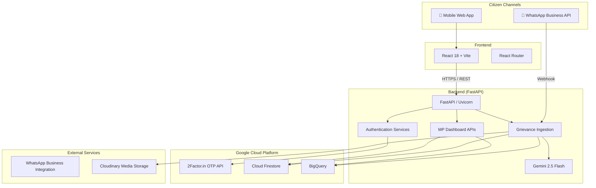
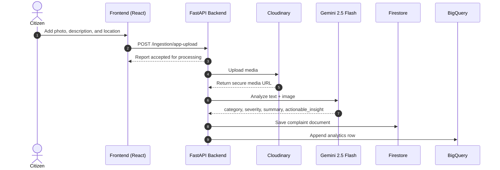
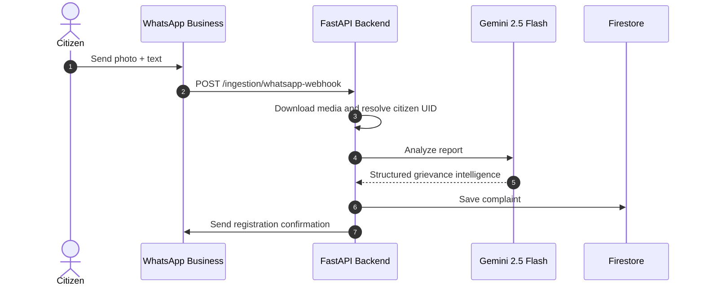
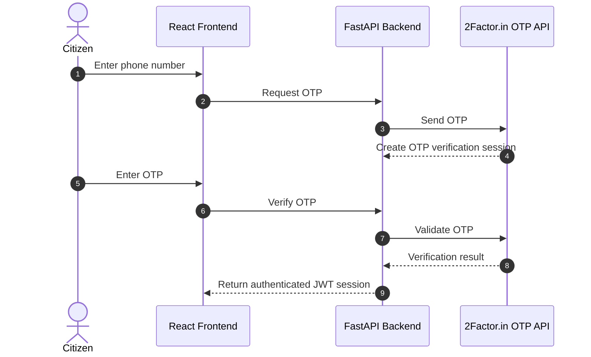
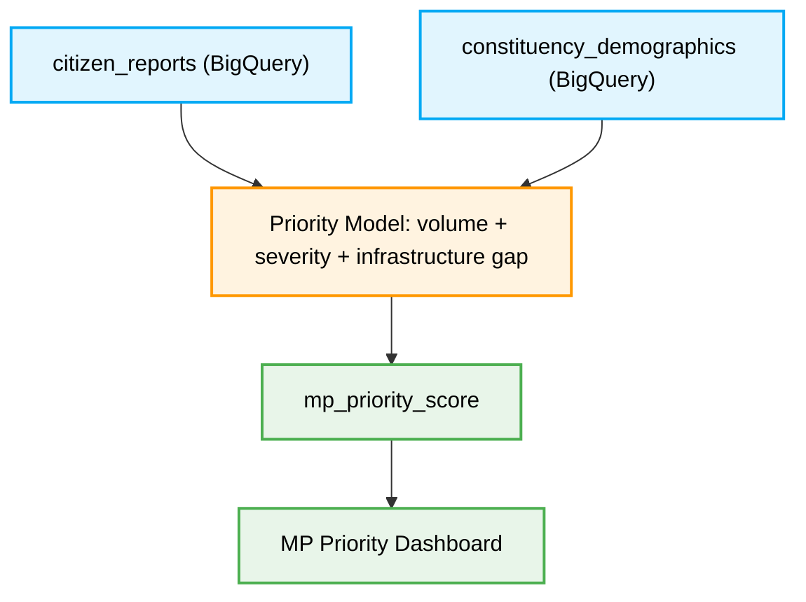
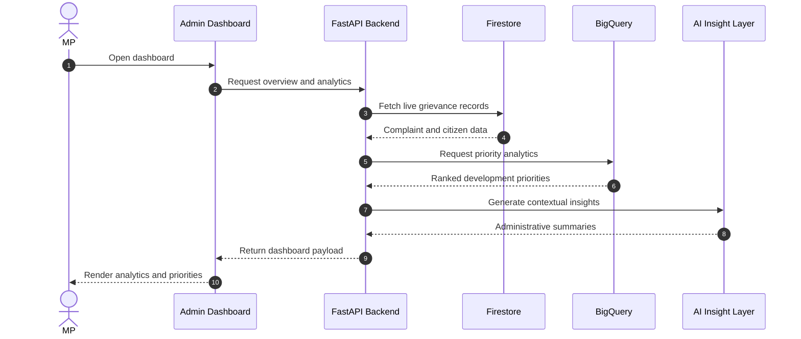

#  Jan Awaaz AI 

[](https://www.python.org/)
[](https://fastapi.tiangolo.com/)
[](https://react.dev/)
[](https://vitejs.dev/)
[](https://ai.google.dev/)
[](https://firebase.google.com/)
[](https://cloud.google.com/bigquery)
[](https://docs.docker.com/compose/)

> **Track 1 --- AI for Constituency Development Planning**

**Jan Awaaz AI** is a multilingual, AI-powered citizen grievance and
constituency development intelligence platform. Citizens can submit
local development issues through a mobile-first web application or
WhatsApp using text and photos. The platform analyzes every report with
Gemini 2.5 Flash, identifies issue categories and severity, maps demand
hotspots, and combines citizen feedback with demographic and
infrastructure data to rank high-priority development works for elected
representatives.

The system connects citizen participation with evidence-based
governance: citizens get a simple reporting and tracking experience,
while MPs receive real-time analytics, grievance intelligence,
constituent insights, and AI-assisted development priorities.

## The Problem

MPs and public representatives receive development requests through
public meetings, letters, social media, grievance portals, WhatsApp
messages, and direct representations. These inputs are fragmented across
channels and difficult to compare objectively.

At the same time, constituency development plans contain many competing
proposals. Without a unified intelligence layer, decision-makers
struggle to:

-   consolidate citizen feedback from multiple channels;
-   identify repeated complaints and geographic demand hotspots;
-   compare the severity and urgency of different local issues;
-   connect public demand with demographic and infrastructure gaps;
-   track grievance progress transparently; and
-   prioritize development works using measurable evidence.

## Our Solution

Jan Awaaz AI provides an end-to-end workflow for citizen reporting, AI
analysis, grievance management, and constituency planning.

1.  **Collect** citizen grievances through a mobile-first web
    application and WhatsApp Business integration.
2.  **Authenticate** citizens natively using 2Factor.in OTP verification without
    requiring email accounts or passwords.
3.  **Analyze** text and images with Gemini 2.5 Flash to extract
    category, severity, summary, and actionable insight.
4.  **Store** complaint records in Cloud Firestore and uploaded media in
    Cloudinary.
5.  **Aggregate** report data into BigQuery for analytical processing.
6.  **Rank** constituency priorities using complaint volume, severity
    weighting, demographic context, and infrastructure gaps.
7.  **Present** live grievance data, analytics, constituent information,
    maps, and AI-generated insights through an MP dashboard.
8.  **Track** grievance progress from submission through resolution.

## Architecture Overview

The platform is structured as a decoupled application with a React
frontend and FastAPI backend. Cloud Firestore provides real-time operational data, BigQuery handles constituency-scale
analytics, Gemini performs multimodal AI analysis, Cloudinary stores
citizen-uploaded media, and WhatsApp integration handles grievance communication. OTP verification is handled separately through 2Factor.in without any SMS-call or voice-call flow in the application architecture.



## Key Features

### Multimodal AI Grievance Analysis

Every citizen submission can contain both text and an image. Gemini 2.5
Flash analyzes the complete report in a single multimodal workflow and
returns structured grievance intelligence.

The AI extracts:

-   `category`
-   `severity`
-   one-sentence `summary`
-   `actionable_insight`

The result is stored with the complaint and surfaced directly to
officials in the administrative dashboard.

### Language-Aware AI

The citizen-facing application supports English and Hindi. AI-generated
summaries and actionable insights can follow the citizen's selected
language preference, allowing the system to produce Hindi content in
Devanagari or English content as required.

### AI-Powered Priority Ranking

BigQuery combines citizen complaint data with constituency demographic
and infrastructure information. The analytical model uses:

-   complaint volume;
-   severity weighting;
-   geographic concentration;
-   demographic context; and
-   infrastructure gaps.

These signals are combined into an `mp_priority_score` that helps
surface the highest-need development areas objectively.

### AI-Generated Dashboard Insights

The MP dashboard computes live patterns from Firestore data and converts
them into concise administrative insights, such as dominant grievance
categories, status distribution, reporting trends, and high-demand issue
areas.

### Bilingual Citizen Experience

The complete citizen-facing interface supports English and Hindi across:

-   authentication;
-   home dashboard;
-   grievance submission;
-   grievance tracking;
-   updates;
-   profile; and
-   navigation.

The translation system is implemented through a custom
`LanguageContext`.

### WhatsApp Grievance Submission

Citizens can submit a grievance by sending a photo and text message
through WhatsApp. The backend receives the webhook, downloads the media,
identifies the citizen, runs AI analysis, stores the complaint, and
sends an automatic confirmation.

### Native Phone-Based Authentication

Citizens authenticate using a phone number and OTP through 2Factor.in. The React frontend sends the phone number and OTP to the FastAPI backend, which securely communicates with the 2Factor.in API. This removes the need for email accounts and passwords, making the platform fast and accessible for rural and low-literacy users.

### Real-Time MP Dashboard

The administrative dashboard provides:

-   category breakdowns;
-   grievance status distribution;
-   weekly activity trends;
-   AI-generated insights;
-   grievance details;
-   citizen information; and
-   development priority analytics.

Dashboard data is computed from live Firestore records.

### Interactive Grievance Details

Officials can inspect a grievance and view:

-   the original citizen description;
-   uploaded image;
-   GPS coordinates;
-   mapped location;
-   AI-generated summary;
-   severity classification;
-   actionable insight; and
-   current grievance status.

### Constituent Directory

Citizens who submit grievances are aggregated into a constituent
directory with complaint counts, activity information, and identity data
cross-referenced with Firebase Authentication records.

### Status Tracking and Interactive Mapping

Citizens can track grievance progress through the lifecycle:

``` text
submitted → in_progress → resolved
```

Clicking on any tracked grievance opens a detailed interactive modal displaying the AI-generated summary, the attached image, and an embedded Google Map that pinpoints the exact coordinates of the submitted issue.

### Geolocation Capture

The submission workflow captures GPS coordinates through the browser
Geolocation API. Location data is stored with each complaint and can be
used for map visualization and hotspot analysis.

### Containerized Deployment

The full platform can be launched using Docker Compose. Backend,
frontend, and Nginx services run in containers with health-check
support.

## Tech Stack

  -----------------------------------------------------------------------
  Component               Technology              Description
  ----------------------- ----------------------- -----------------------
  Frontend                React 18, Vite, React   Mobile-first citizen
                          Router                  application and MP
                                                  dashboard

  Styling                 Tailwind CSS            Responsive
                                                  utility-first interface
                                                  and loading states

  Charts                  Recharts                Category, status, and
                                                  activity visualizations

  Backend                 FastAPI, Uvicorn        Asynchronous Python API
                                                  and service
                                                  orchestration

  AI                      Gemini 2.5 Flash        Multimodal grievance
                                                  analysis and generated
                                                  insights

  Citizen Authentication  2Factor.in OTP          OTP-based verification
                                                  through FastAPI backend

  MP Authentication       Firestore + PyJWT +     Hashed credentials and
                          bcrypt                  JWT sessions

  Database                Cloud Firestore         Live grievance,
                                                  citizen, and MP records

  Analytics               BigQuery                Priority scoring and
                                                  constituency data
                                                  analysis

  Media                   Cloudinary              Citizen-uploaded image
                                                  storage and CDN
                                                  delivery

  Messaging               WhatsApp                WhatsApp Business       Citizen grievance submission
                                                  integration

  Deployment              Docker Compose, Nginx   Containerized
                                                  application deployment
  -----------------------------------------------------------------------

## Google Cloud Products Used

  -----------------------------------------------------------------------
  Product                             How It Is Used
  ----------------------------------- -----------------------------------
  Gemini 2.5 Flash                    Multimodal analysis of
                                      citizen-submitted text and images

  Cloud Firestore                     Primary real-time operational
                                      database

  BigQuery                            Analytical engine for
                                      development-priority scoring

  Cloud Firestore                     Citizen profiles, grievances, and
                                      operational application data
  -----------------------------------------------------------------------

## Logic Flows

### Citizen Report Submission



### WhatsApp Grievance Submission



### Citizen OTP Authentication



### MP Priority Ranking



### MP Dashboard Data Flow



## Project Structure

``` text
.
├── backend/
│   ├── app/
│   │   ├── api/
│   │   │   ├── auth/               # MP login and JWT authentication
│   │   │   ├── citizen/            # 2Factor.in citizen OTP auth and complaint listing
│   │   │   ├── complaints/         # Complaint create/read services
│   │   │   ├── ingestion/          # App uploads and WhatsApp webhook
│   │   │   └── mp/                 # MP dashboard and priority APIs
│   │   ├── core/
│   │   │   ├── ai_service.py       # Gemini multimodal analysis
│   │   │   ├── bigquery_client.py  # BigQuery client singleton
│   │   │   ├── firebase.py         # Firebase authentication helpers
│   │   │   ├── firestore_client.py # Firestore client singleton
│   │   │   ├── security.py         # JWT, bcrypt, OTP, auth dependencies
│   │   │   ├── whatsapp_service.py   # WhatsApp integration services
│   │   │   └── config.py           # Environment-based settings
│   │   └── main.py                 # FastAPI application entry point
│   ├── scripts/
│   │   └── create_mp.py            # Secure MP account provisioning CLI
│   ├── Dockerfile
│   └── requirements.txt
├── frontend/
│   ├── src/
│   │   ├── pages/
│   │   │   ├── Citizen*.jsx        # Citizen login, home, submit, track, updates, profile
│   │   │   ├── Admin*.jsx          # Dashboard, grievances, constituents, analytics, settings
│   │   │   └── MPLogin.jsx         # MP authentication
│   │   ├── layouts/                # CitizenLayout and AdminLayout
│   │   ├── components/             # Cards, tables, modals, chips, skeletons
│   │   ├── context/
│   │   │   ├── AuthContext.jsx     # MP and citizen authentication state
│   │   │   └── LanguageContext.jsx # English/Hindi translation system
│   │   └── firebase.js             # Firebase Web SDK initialization
│   ├── Dockerfile
│   └── package.json
├── docker-compose.yml
├── backend/.env.example
├── frontend/.env.example
└── README.md
```

## Installation and Setup

### Prerequisites

Ensure the following are available:

-   Python 3.11 or newer
-   Node.js 18 or newer
-   Docker and Docker Compose
-   Firebase project with Firestore enabled
-   Google Cloud project with BigQuery enabled
-   Gemini API key
-   Cloudinary account
-   2Factor.in account with OTP API access
-   WhatsApp Business configuration if WhatsApp submission is enabled

### Quick Start with Docker

1.  Clone the repository:

``` bash
git clone https://github.com/Harshit-Awasthi-05/Jan-Awaaz-AI.git
cd Jan-Awaaz-AI
```

2.  Create environment files:

``` bash
cp backend/.env.example backend/.env
cp frontend/.env.example frontend/.env
```

3.  Add the required credentials and configuration values.

4.  Launch the complete stack:

``` bash
docker-compose up --build
```

The frontend is available at:

``` text
http://localhost
```

The API is available at:

``` text
http://localhost:8000
```

## Manual Development Setup

### Backend

``` bash
cd backend
python -m venv venv
```

Activate the virtual environment.

**Windows PowerShell:**

``` powershell
.\venv\Scripts\Activate.ps1
```

**Windows Command Prompt:**

``` cmd
venv\Scripts\activate
```

**Linux/macOS:**

``` bash
source venv/bin/activate
```

Install dependencies:

``` bash
pip install -r requirements.txt
```

Create the environment file:

``` bash
cp .env.example .env
```

Configure the required backend variables, including:

``` text
GEMINI_API_KEY
GOOGLE_APPLICATION_CREDENTIALS
SECRET_KEY
CLOUDINARY_*
TWILIO_*
GCP_PROJECT_ID
```

Start the backend:

``` bash
uvicorn app.main:app --reload
```

### Firebase Service Account

1.  Open Firebase Console.
2.  Go to **Project Settings**.
3.  Open **Service Accounts**.
4.  Select **Generate New Private Key**.
5.  Save the JSON credential file securely in the backend environment.
6.  Set `GOOGLE_APPLICATION_CREDENTIALS` to the credential file path.

Do not commit the service-account file to Git.

### Frontend

``` bash
cd frontend
npm install
```

Create the environment file:

``` bash
cp .env.example .env
```

Configure:

-   `VITE_API_BASE_URL`
-   Frontend application settings

Start the development server:

``` bash
npm run dev
```

## Creating MP Accounts

MP accounts are provisioned securely through a CLI script rather than
public registration.

``` bash
cd backend
python scripts/create_mp.py \
  --email "mp@constituency.gov.in" \
  --name "Shri Example MP" \
  --constituency "Central District" \
  --phone "+919876543210" \
  --password "SecurePassword"
```

The password is hashed with bcrypt before storage.

## API Reference

### Health Check

``` bash
curl http://127.0.0.1:8000/
```

Expected response:

``` json
{
  "status": "Core engine online",
  "project": "Jan Awaaz AI"
}
```

### Submit a Citizen Report

``` bash
curl -X POST http://127.0.0.1:8000/api/v1/ingestion/app-upload \
  -H "Authorization: Bearer <CITIZEN_JWT>" \
  -F "file=@pothole.jpg" \
  -F "latitude=28.6139" \
  -F "longitude=77.2090" \
  -F "description=Large pothole causing traffic near the market" \
  -F "constituency=Central District"
```

### MP Dashboard Overview

``` bash
curl \
  -H "Authorization: Bearer <MP_JWT>" \
  http://127.0.0.1:8000/api/v1/mp/dashboard/overview
```

## Environment Variables

### Backend

  Variable                           Purpose
  ---------------------------------- -----------------------------------
  `GEMINI_API_KEY`                   Gemini multimodal AI access
  `GOOGLE_APPLICATION_CREDENTIALS`   Firebase/GCP service-account path
  `GCP_PROJECT_ID`                   Google Cloud project identifier
  `SECRET_KEY`                       JWT signing secret
  `CLOUDINARY_CLOUD_NAME`            Cloudinary account identifier
  `CLOUDINARY_API_KEY`               Cloudinary API access
  `CLOUDINARY_API_SECRET`            Cloudinary secret
  `WHATSAPP_ACCESS_TOKEN`               WhatsApp Business API access token
  `WHATSAPP_PHONE_NUMBER_ID`                WhatsApp Business phone number identifier
  `TWO_FACTOR_API_KEY`                2Factor.in OTP API credential

### Frontend

  Variable                     Purpose
  ---------------------------- -------------------------------------
  `VITE_API_BASE_URL`          FastAPI backend base URL
  Firebase Web SDK variables   Browser-side Firebase configuration

## Security

-   Gemini credentials, WhatsApp credentials, Cloudinary secrets, JWT
    secrets, and service-account files must remain backend-only.
-   MP passwords are stored as bcrypt hashes and never as plaintext.
-   MP API routes use JWT-based authentication.
-   Citizen authentication is verified through the backend using 2Factor.in OTP, followed by JWT-based sessions.
-   Sensitive environment files and service-account credentials must be
    included in `.gitignore`.
-   Production deployments should restrict CORS origins to trusted
    frontend domains.
-   API credentials should be rotated immediately if accidentally
    committed to version control.

## Deployment

### Docker Compose

Build and launch the application:

``` bash
docker-compose up --build
```

Run in detached mode:

``` bash
docker-compose up --build -d
```

Stop the application:

``` bash
docker-compose down
```

### Production Deployment Considerations

Before production deployment:

-   replace development secrets with production credentials;
-   configure HTTPS;
-   restrict CORS;
-   apply Firebase Security Rules;
-   configure BigQuery dataset permissions;
-   restrict service-account IAM roles;
-   configure WhatsApp webhook URLs;
-   set Cloudinary upload restrictions;
-   enable logging and monitoring; and
-   validate health checks for all services.

## Testing and Verification

Verify the backend health endpoint:

``` bash
curl http://127.0.0.1:8000/
```

Verify the frontend development build:

``` bash
cd frontend
npm run build
```

Verify backend imports and application startup:

``` bash
cd backend
uvicorn app.main:app --reload
```

For production readiness, the project should maintain automated tests
for:

-   authentication;
-   OTP verification;
-   grievance submission;
-   AI response parsing;
-   Firestore operations;
-   BigQuery synchronization;
-   MP authorization; and
-   dashboard APIs.

## Typical User Journey

### Citizen

1.  Open the mobile web application.
2.  Select English or Hindi.
3.  Enter a phone number.
4.  Verify the OTP.
5.  Submit a grievance with text, photo, and location.
6.  Receive confirmation.
7.  Track the grievance status.
8.  View updates until resolution.

### MP / Official

1.  Sign in through the MP portal.
2.  Review the live constituency dashboard.
3.  Inspect grievance trends and high-severity reports.
4.  Open individual grievance details.
5.  Review citizen location and AI-generated analysis.
6.  Examine ranked development priorities.
7.  Track grievance progress and constituency demand patterns.

## Future Scope

Potential extensions include:

-   additional Indian languages;
-   voice-based grievance submission;
-   speech-to-text for low-literacy users;
-   ward and panchayat-level hotspot maps;
-   automated department routing;
-   SLA tracking and escalation;
-   duplicate grievance detection;
-   semantic search across grievances;
-   predictive issue trends;
-   public transparency dashboards; and
-   direct integration with government grievance systems.

## License

Built for the **Google AI Hackathon 2026 --- Track 1: People's
Priorities**.

---

# Complete Working Application Structure

The following structure represents the complete recommended working architecture of **Jan Awaaz AI**, including the React frontend, FastAPI backend, 2Factor.in OTP authentication, Firestore, Gemini AI, BigQuery analytics, Cloudinary media storage, WhatsApp integration, Docker, tests, and deployment configuration.

```text
Jan-Awaaz-AI/
│
├── README.md
├── .gitignore
├── docker-compose.yml
├── nginx.conf
│
├── backend/
│   ├── .env
│   ├── .env.example
│   ├── .dockerignore
│   ├── Dockerfile
│   ├── requirements.txt
│   ├── pytest.ini
│   │
│   ├── app/
│   │   ├── __init__.py
│   │   ├── main.py
│   │   │
│   │   ├── api/
│   │   │   ├── __init__.py
│   │   │   ├── router.py
│   │   │   │
│   │   │   ├── auth/
│   │   │   │   ├── __init__.py
│   │   │   │   ├── routes.py
│   │   │   │   ├── schemas.py
│   │   │   │   └── service.py
│   │   │   │
│   │   │   ├── citizen/
│   │   │   │   ├── __init__.py
│   │   │   │   ├── routes.py
│   │   │   │   ├── schemas.py
│   │   │   │   └── service.py
│   │   │   │
│   │   │   ├── complaints/
│   │   │   │   ├── __init__.py
│   │   │   │   ├── routes.py
│   │   │   │   ├── schemas.py
│   │   │   │   └── service.py
│   │   │   │
│   │   │   ├── ingestion/
│   │   │   │   ├── __init__.py
│   │   │   │   ├── routes.py
│   │   │   │   ├── schemas.py
│   │   │   │   └── service.py
│   │   │   │
│   │   │   └── mp/
│   │   │       ├── __init__.py
│   │   │       ├── routes.py
│   │   │       ├── schemas.py
│   │   │       └── service.py
│   │   │
│   │   ├── core/
│   │   │   ├── __init__.py
│   │   │   ├── config.py
│   │   │   ├── security.py
│   │   │   ├── dependencies.py
│   │   │   ├── exceptions.py
│   │   │   ├── logging.py
│   │   │   ├── twofactor_service.py
│   │   │   ├── firebase.py
│   │   │   ├── firestore_client.py
│   │   │   ├── bigquery_client.py
│   │   │   ├── ai_service.py
│   │   │   ├── cloudinary_service.py
│   │   │   └── whatsapp_service.py
│   │   │
│   │   ├── models/
│   │   │   ├── __init__.py
│   │   │   ├── citizen.py
│   │   │   ├── complaint.py
│   │   │   └── mp.py
│   │   │
│   │   ├── repositories/
│   │   │   ├── __init__.py
│   │   │   ├── citizen_repository.py
│   │   │   ├── complaint_repository.py
│   │   │   └── mp_repository.py
│   │   │
│   │   ├── services/
│   │   │   ├── __init__.py
│   │   │   ├── auth_service.py
│   │   │   ├── grievance_service.py
│   │   │   ├── analytics_service.py
│   │   │   ├── priority_service.py
│   │   │   └── notification_service.py
│   │   │
│   │   └── utils/
│   │       ├── __init__.py
│   │       ├── constants.py
│   │       ├── validators.py
│   │       ├── phone.py
│   │       └── response.py
│   │
│   ├── scripts/
│   │   ├── create_mp.py
│   │   ├── seed_demo_data.py
│   │   └── setup_bigquery.py
│   │
│   └── tests/
│       ├── __init__.py
│       ├── conftest.py
│       ├── test_auth.py
│       ├── test_citizen.py
│       ├── test_complaints.py
│       ├── test_ingestion.py
│       └── test_mp_dashboard.py
│
├── frontend/
│   ├── .env
│   ├── .env.example
│   ├── .dockerignore
│   ├── Dockerfile
│   ├── index.html
│   ├── package.json
│   ├── package-lock.json
│   ├── vite.config.js
│   ├── tailwind.config.js
│   ├── postcss.config.js
│   │
│   ├── public/
│   │   ├── favicon.svg
│   │   ├── logo.svg
│   │   └── manifest.json
│   │
│   └── src/
│       ├── main.jsx
│       ├── App.jsx
│       ├── index.css
│       │
│       ├── api/
│       │   ├── client.js
│       │   ├── authApi.js
│       │   ├── citizenApi.js
│       │   ├── complaintApi.js
│       │   └── mpApi.js
│       │
│       ├── assets/
│       │   ├── images/
│       │   └── icons/
│       │
│       ├── components/
│       │   ├── common/
│       │   │   ├── Button.jsx
│       │   │   ├── Input.jsx
│       │   │   ├── Loader.jsx
│       │   │   ├── Modal.jsx
│       │   │   ├── StatusBadge.jsx
│       │   │   └── ErrorBoundary.jsx
│       │   │
│       │   ├── citizen/
│       │   │   ├── ComplaintCard.jsx
│       │   │   ├── ComplaintDetailsModal.jsx
│       │   │   ├── LanguageSelector.jsx
│       │   │   ├── LocationPicker.jsx
│       │   │   └── MobileBottomNav.jsx
│       │   │
│       │   └── admin/
│       │       ├── AdminSidebar.jsx
│       │       ├── AnalyticsChart.jsx
│       │       ├── GrievanceTable.jsx
│       │       ├── PriorityCard.jsx
│       │       └── StatCard.jsx
│       │
│       ├── context/
│       │   ├── AuthContext.jsx
│       │   └── LanguageContext.jsx
│       │
│       ├── hooks/
│       │   ├── useAuth.js
│       │   ├── useGeolocation.js
│       │   └── useLanguage.js
│       │
│       ├── layouts/
│       │   ├── CitizenLayout.jsx
│       │   └── AdminLayout.jsx
│       │
│       ├── pages/
│       │   ├── citizen/
│       │   │   ├── CitizenLogin.jsx
│       │   │   ├── CitizenOTP.jsx
│       │   │   ├── CitizenHome.jsx
│       │   │   ├── CitizenSubmit.jsx
│       │   │   ├── CitizenTrack.jsx
│       │   │   ├── CitizenUpdates.jsx
│       │   │   └── CitizenProfile.jsx
│       │   │
│       │   └── admin/
│       │       ├── MPLogin.jsx
│       │       ├── AdminDashboard.jsx
│       │       ├── AdminGrievances.jsx
│       │       ├── AdminConstituents.jsx
│       │       ├── AdminAnalytics.jsx
│       │       └── AdminSettings.jsx
│       │
│       ├── routes/
│       │   ├── ProtectedRoute.jsx
│       │   └── RoleRoute.jsx
│       │
│       └── utils/
│           ├── constants.js
│           ├── formatters.js
│           ├── storage.js
│           └── validators.js
│
├── infrastructure/
│   ├── firestore/
│   │   ├── firestore.rules
│   │   └── firestore.indexes.json
│   │
│   ├── bigquery/
│   │   ├── schema.sql
│   │   ├── priority_query.sql
│   │   └── seed_data.sql
│   │
│   └── nginx/
│       └── default.conf
│
└── docs/
    ├── architecture.md
    ├── api.md
    ├── deployment.md
    └── screenshots/
```

## How the Complete Application Works

### 1. Citizen Authentication

```text
Citizen
   ↓
React Login Page
   ↓
POST /api/v1/citizen/auth/send-otp
   ↓
FastAPI Backend
   ↓
2Factor.in OTP API
   ↓
OTP verification session created
   ↓
Citizen enters OTP
   ↓
POST /api/v1/citizen/auth/verify-otp
   ↓
FastAPI verifies OTP
   ↓
Citizen profile created or loaded from Firestore
   ↓
JWT access token returned
   ↓
Citizen enters protected application
```

### 2. Grievance Submission

```text
Citizen adds:
Text + Image + GPS Location
   ↓
React CitizenSubmit page
   ↓
POST /api/v1/ingestion/app-upload
   ↓
JWT authentication check
   ↓
Image uploaded to Cloudinary
   ↓
Gemini analyzes text + image
   ↓
AI returns:
Category
Severity
Summary
Actionable Insight
   ↓
Complaint stored in Firestore
   ↓
Analytics row sent to BigQuery
   ↓
Complaint ID returned to citizen
```

### 3. Citizen Grievance Tracking

```text
Citizen Dashboard
   ↓
GET /api/v1/citizen/complaints
   ↓
FastAPI reads citizen UID from JWT
   ↓
Firestore returns citizen complaints
   ↓
React displays:
Submitted
In Progress
Resolved
   ↓
Citizen opens complaint
   ↓
Details + Image + AI Analysis + Map displayed
```

### 4. MP Authentication

```text
MP enters email and password
   ↓
FastAPI verifies bcrypt password hash
   ↓
OTP challenge generated
   ↓
Backend issues MP JWT
   ↓
Protected Admin Dashboard opens
```

### 5. MP Dashboard

```text
MP Dashboard
   ↓
FastAPI Dashboard APIs
   ↓
Firestore → Live grievance records
BigQuery → Priority analytics
Gemini → Administrative insights
   ↓
Dashboard displays:
Total grievances
Pending cases
Resolved cases
Severity distribution
Category distribution
Weekly trends
Constituent directory
Priority development areas
AI-generated insights
```

### 6. AI Priority Ranking

```text
Complaint Volume
      +
Severity Weight
      +
Geographic Concentration
      +
Demographic Need
      +
Infrastructure Gap
      ↓
BigQuery Analytical Model
      ↓
MP Priority Score
      ↓
Ranked Development Priorities
      ↓
MP Analytics Dashboard
```

## Required Backend Environment

```env
APP_NAME=Jan Awaaz AI
APP_ENV=development
DEBUG=true

SECRET_KEY=replace_with_secure_random_secret
ACCESS_TOKEN_EXPIRE_MINUTES=1440

TWO_FACTOR_API_KEY=your_2factor_api_key

GOOGLE_APPLICATION_CREDENTIALS=path/to/service-account.json
GCP_PROJECT_ID=your_google_cloud_project_id
FIRESTORE_DATABASE_ID=(default)
BIGQUERY_DATASET=jan_awaaz_ai

GEMINI_API_KEY=your_gemini_api_key

CLOUDINARY_CLOUD_NAME=your_cloud_name
CLOUDINARY_API_KEY=your_cloudinary_api_key
CLOUDINARY_API_SECRET=your_cloudinary_api_secret

WHATSAPP_ACCESS_TOKEN=your_whatsapp_access_token
WHATSAPP_PHONE_NUMBER_ID=your_whatsapp_phone_number_id

FRONTEND_URL=http://localhost:5173
```

## Required Frontend Environment

```env
VITE_API_BASE_URL=http://127.0.0.1:8000/api/v1
```

## Core API Routes

| Method | Route | Purpose |
|---|---|---|
| `POST` | `/api/v1/citizen/auth/send-otp` | Start citizen OTP verification |
| `POST` | `/api/v1/citizen/auth/verify-otp` | Verify citizen OTP and issue JWT |
| `GET` | `/api/v1/citizen/me` | Get logged-in citizen profile |
| `GET` | `/api/v1/citizen/complaints` | Get citizen grievances |
| `POST` | `/api/v1/ingestion/app-upload` | Submit app grievance |
| `POST` | `/api/v1/ingestion/whatsapp-webhook` | Receive WhatsApp grievance |
| `POST` | `/api/v1/auth/mp/login` | Verify MP credentials |
| | `GET` | `/api/v1/mp/dashboard/overview` | Dashboard statistics |
| `GET` | `/api/v1/mp/grievances` | List all grievances |
| `GET` | `/api/v1/mp/grievances/{id}` | Get grievance details |
| `PATCH` | `/api/v1/mp/grievances/{id}/status` | Update grievance status |
| `GET` | `/api/v1/mp/constituents` | Get constituent directory |
| `GET` | `/api/v1/mp/analytics` | Get analytics |
| `GET` | `/api/v1/mp/priorities` | Get ranked priorities |

## Local Startup Order

```text
1. Configure backend/.env
2. Add Firebase/GCP service-account JSON
3. Start FastAPI backend
4. Verify backend health endpoint
5. Configure frontend/.env
6. Start React frontend
7. Test 2Factor.in citizen OTP
8. Create an MP account with scripts/create_mp.py
9. Test MP login and JWT session
10. Submit a grievance
11. Verify Firestore record
12. Verify Cloudinary image
13. Verify Gemini analysis
14. Open MP dashboard
15. Verify BigQuery priority analytics
```

### Start Backend

```bash
cd backend
python -m venv venv
.\venv\Scripts\Activate.ps1
pip install -r requirements.txt
uvicorn app.main:app --reload
```

### Start Frontend

```bash
cd frontend
npm install
npm run dev
```

### Production Startup

```bash
docker-compose up --build -d
```

With this structure, the application has a clear separation between frontend presentation, backend APIs, business services, external integrations, data repositories, analytics infrastructure, testing, and deployment.

